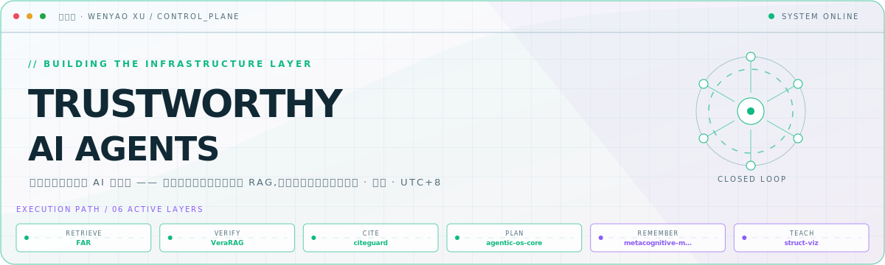
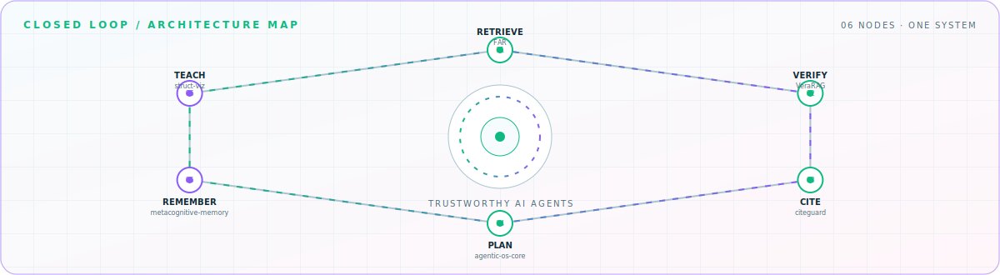

<picture>
  <source media="(prefers-color-scheme: dark)" srcset="hero-dark.svg">
  <source media="(prefers-color-scheme: light)" srcset="hero-light.svg">
  
</picture>

 

构建会自我验证的 AI 智能体 —— 从证伪引导检索、可验证 RAG,到可审计的记忆与规划。

## Flagship systems

| Repository | Role | Purpose |
| --- | --- | --- |
| [`struct-viz`](https://github.com/xiaweiyi713/struct-viz)  | TEACH | 408 考研四科算法可视化:数据结构 · 组成原理 · 操作系统 · 计算机网络 |
| [`FAR`](https://github.com/xiaweiyi713/FAR)  | RETRIEVE | 面向自我纠错语言智能体的类型化证伪引导检索 |
| [`VeraRAG`](https://github.com/xiaweiyi713/VeraRAG)  | VERIFY | 可验证的智能体检索增强推理系统 |
| [`citeguard`](https://github.com/xiaweiyi713/citeguard)  | CITE | 证伪优先的引用核验:存在性 · 元数据 · 论点支撑三重检查 |
| [`agentic-os-core`](https://github.com/xiaweiyi713/agentic-os-core)  | PLAN | 面向 AI 智能体的图记忆与 MCTS 规划引擎,零依赖 |

## Closed-loop architecture

<picture>
  <source media="(prefers-color-scheme: dark)" srcset="closed-loop-dark.svg">
  <source media="(prefers-color-scheme: light)" srcset="closed-loop-light.svg">
  
</picture>

## Module registry

<strong>Applied agents</strong> · 2 modules

| Module | Purpose |
| --- | --- |
| [`CartCompass`](https://github.com/xiaweiyi713/CartCompass) | 基于 RAG 的多模态电商导购智能体(原生 iOS \+ FastAPI) |
| [`MailAI`](https://github.com/xiaweiyi713/MailAI) | 接入多 LLM 的智能邮件管理 App(SwiftUI · iOS 17) |

<strong>Research</strong> · 4 modules

| Module | Purpose |
| --- | --- |
| [`KAFNet`](https://github.com/xiaweiyi713/KAFNet) | Kolmogorov–Arnold 频率自适应网络,用于图像分类与去噪 |
| [`game-behavior-classifier`](https://github.com/xiaweiyi713/game-behavior-classifier) | CatBoost \+ Transformer 双轨玩家行为分类(腾讯游戏安全 2026) |
| [`game-behavior-retrieval-predictor`](https://github.com/xiaweiyi713/game-behavior-retrieval-predictor) | 基于检索的玩家行为预测,TF-IDF \+ 条件路由 |
| [`metacognitive-memory`](https://github.com/xiaweiyi713/metacognitive-memory) | 反思增强的智能体记忆研究原型 |

<strong>Systems</strong> · 2 modules

| Module | Purpose |
| --- | --- |
| [`StableTrace-AI`](https://github.com/xiaweiyi713/StableTrace-AI) | AI 驱动的稳定币合规与 KYT 链上分析平台 |
| [`SeamPano-MATLAB`](https://github.com/xiaweiyi713/SeamPano-MATLAB) | 图像接缝全景拼接(MATLAB) |

<a href="https://github.com/xiaweiyi713">GitHub</a> · <a href="https://www.swufe.edu.cn/">SWUFE</a>

<!-- Generated by profile-control-plane. Edit profile.yaml, not this file. -->
